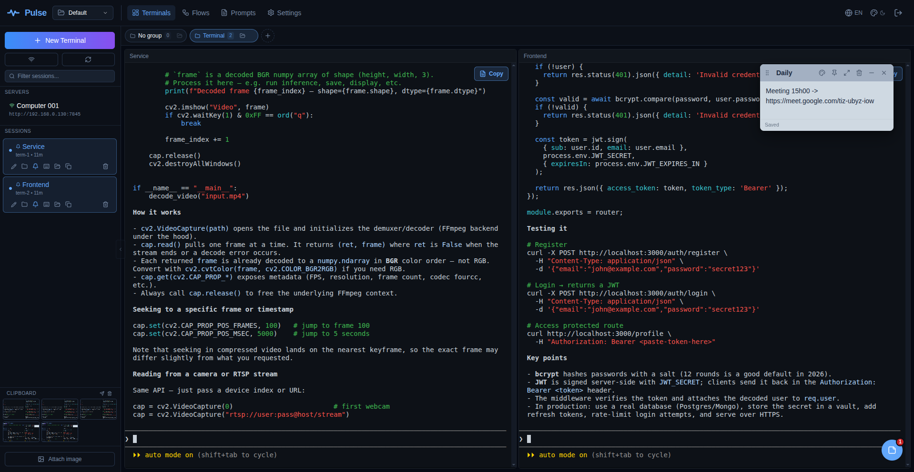
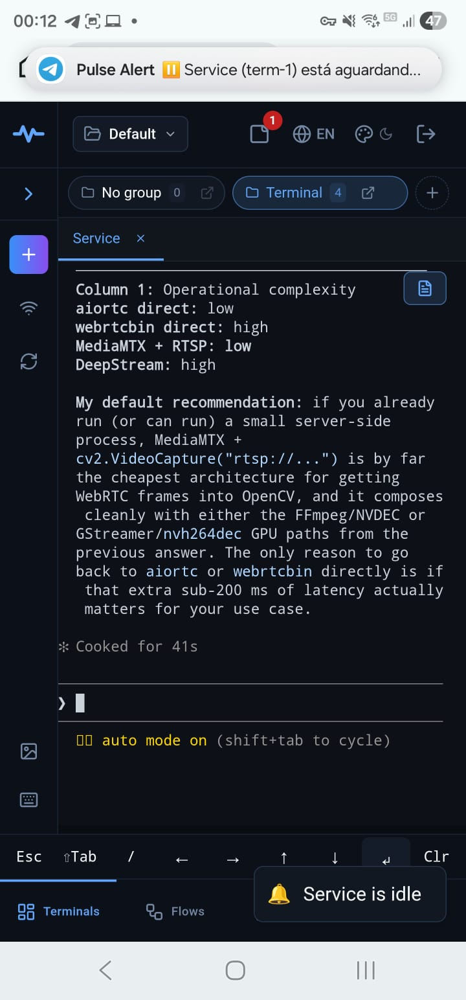
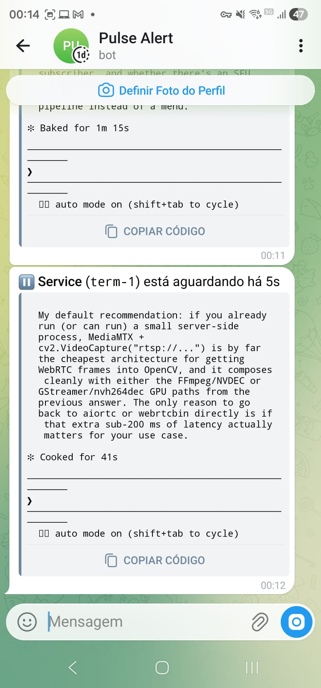
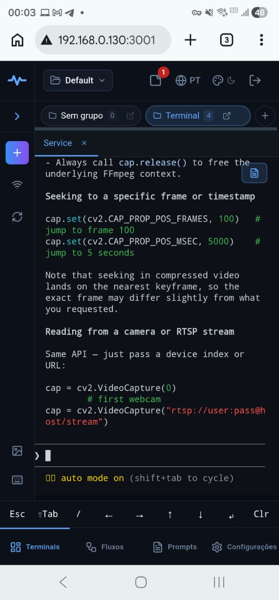
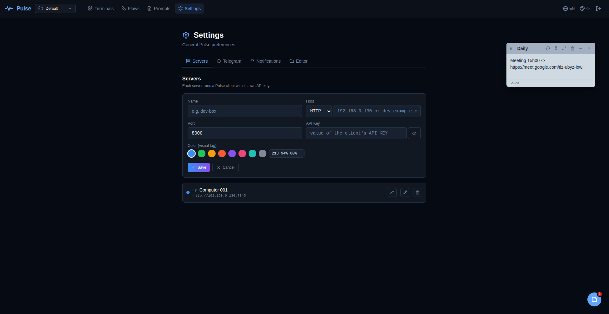
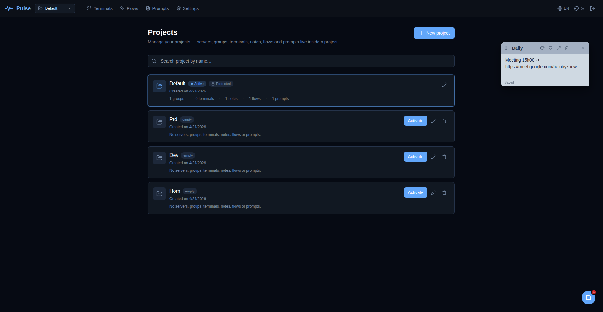
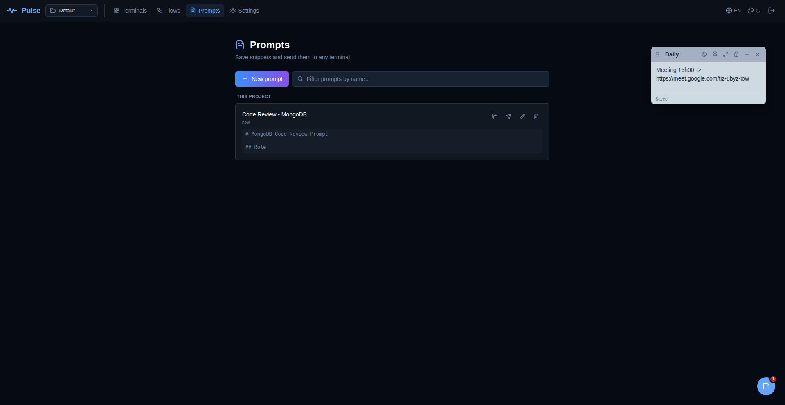
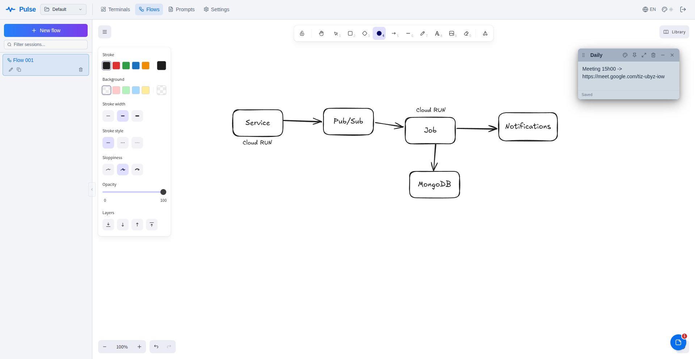

<p align="center">
  
</p>

<h1 align="center">Pulse</h1>

<p align="center">
  <strong>Stop babysitting your AI coding agents.</strong><br/>
  A web dashboard for your tmux sessions — idle alerts when Claude Code, Cursor, Codex or Gemini stops typing, mobile control from anywhere, shared workspace for every session you run.
</p>

<p align="center">
  <a href="LICENSE"></a>
  <a href="https://github.com/kevinzezel/pulse/releases"></a>
  <a href="https://github.com/kevinzezel/pulse/stargazers"></a>
</p>

> **Who is this for?** Developers who run long-running AI coding sessions (Claude Code, Cursor CLI, Codex, Gemini) and want to know the moment they need attention — without staying glued to the terminal.

<p align="center">
  <sub>Tested with <strong>Claude Code</strong>, <strong>Cursor CLI</strong>, <strong>Codex CLI</strong>, <strong>Gemini CLI</strong> — works with any CLI that runs in a shell.</sub>
</p>

<p align="center">
  
</p>

You kick off Claude Code, wait three minutes, come back — it's been idle for two and a half, waiting on a Yes/No prompt. Leave the desk for a coffee and your phone buzzes: `frontend::refactor is idle — Approve edit to layout.js?`. You tap yes, it keeps going.

Pulse runs on your machine, speaks to real tmux, doesn't containerize anything, doesn't phone home.

## Install

**Linux / macOS:**

```sh
curl -fsSL https://raw.githubusercontent.com/kevinzezel/pulse/main/install/install.sh | sh
```

**Windows** (requires [WSL2](https://learn.microsoft.com/en-us/windows/wsl/install)):

```powershell
irm https://raw.githubusercontent.com/kevinzezel/pulse/main/install/install.ps1 | iex
```

Open `http://localhost:3000` when it finishes. That's it.

<p align="center">
  
</p>

> **Pin a version** — `PULSE_VERSION=v1.9.2 curl -fsSL …/install.sh | sh` &nbsp;·&nbsp; **Client only** (remote server) — `PULSE_CLIENT_ONLY=1 curl -fsSL …/install.sh | sh` &nbsp;·&nbsp; **All flags** — see [the installer source](install/install.sh).

## Why Pulse?

- **vs. a local terminal.** Close the lid and the agent freezes waiting for your input. Pulse's tmux sessions outlive laptop sleep; the idle watcher pings your phone the moment the output stops moving.
- **vs. `tmux` + `ttyd`/`gotty`.** You get a terminal in a browser, but no project-scoped groups, no mobile keybar sized for AI approvals, no notifications, no per-pane "open in VSCode".
- **vs. Tabby / iTerm / Warp.** Single device, no remote-by-default, no shared workspace with notes and flow diagrams.

## Features

### Don't miss an approval prompt

Every 5 seconds Pulse MD5s the tmux pane. Thirty seconds of no change after your last Enter = the AI is waiting on you. The threshold is tunable per deployment (5 seconds to 1 hour) and the toggle is per session — a bell in the sidebar flips it on, persisted as a tmux option so it survives restarts.

Notifications land in the **browser** (toast + sound + Web Notification API) while the dashboard is open, and on **Telegram** when it isn't — so the phone in your pocket tells you when the agent stops. The payload carries the last 20 lines of pane output, which is usually enough to decide yes/no without opening the dashboard.

**No false positives.** The watcher applies five rules in order: ignore the alert if the pane hasn't changed since the watcher armed (no startup spam), if you're still typing into a buffer (`bytes_since_enter > 0`), if the timeout hasn't elapsed yet, if the same pane state was already alerted in the last 30 minutes (dedup by content hash), or if your browser is sending a `viewing` heartbeat for that exact terminal — meaning you're already looking at it. See [`NOTIFICATIONS.md`](NOTIFICATIONS.md) for the full design.

<table>
  <tr>
    <td width="50%" align="center">
      
      <br/><sub>Browser notification when the dashboard is open</sub>
    </td>
    <td width="50%" align="center">
      
      <br/><sub>Telegram alert when it isn't — with the last 20 lines of output</sub>
    </td>
  </tr>
</table>

### Work from any device

Fully responsive (rebuilt, not "friendly"). On mobile, `TerminalMosaic` switches to a tab-based layout because `react-mosaic` doesn't play well with touch. A keybar pinned to the bottom gives you `Esc · Tab · ← → ↑ ↓ · Enter · Ctrl+C` — the exact keys the major AI CLIs ask for during approvals.

Touch scroll inside the terminal works via synthesized VT200 mouse-wheel escapes, so Claude Code, `less`, and `vim` all scroll as if you had a wheel. The viewport is pinned (`interactiveWidget: resizes-content`) so the virtual keyboard pushes the page up instead of covering the terminal.

<p align="center">
  
</p>

### One dashboard, every server

Pulse splits into a **dashboard** (the web UI) and a **client** (the agent that runs tmux on a host). One dashboard manages clients on many machines — your local box, a VPS, a LAN home-lab — each with its own color tag, health check, and API key. Session IDs are prefixed `srv-xxx::term-N` so you never lose track of which box a terminal lives on.

Restart the client? Sessions rebuild from `tmux list-sessions`. Reboot the host? A snapshot recreates them with the same name, group, project, cwd, and notify-on-idle flag. Nothing to lose.

<p align="center">
  
</p>

📖 **Setting up multiple machines?** See [`docs/MULTI-SERVER.md`](docs/MULTI-SERVER.md) for the client-only install, registration walkthrough, and reverse-proxy notes.

### Multi-project, multi-session

Two levels of grouping: **Projects** at the top (switchable from the header) and **Groups** inside each project. Assign any session to a group; open every session in a group with one click; hide groups you don't want to see today. Drag-and-drop reorders both.

Mosaic layouts are saved per `project::group` pair *and* per browser tab — open two tabs in Chrome, split them differently, refresh either: each comes back exactly as you left it. Across devices, your selected group and active flow restore precisely too.

<p align="center">
  
</p>

### Keep context alive

- **Sticky notes** — draggable, resizable, color-themed, pinned and minimizable. Stored per project. Auto-saved.
- **Saved prompts** — a searchable library of reusable prompts. One click copies to clipboard or sends straight to the active terminal, with or without Enter. Scope them globally or per project.
- **Flows** — Excalidraw embedded as a page. Multiple diagrams per project, auto-saved, themed alongside the rest of the dashboard.
- **Paste images** — drop a screenshot into the dashboard; Pulse uploads it to the host's `/tmp` and types `@/tmp/…` into the active pane (the Claude Code way to attach an image).
- **Capture as text** — every pane has a button to grab its full scrollback as plain text — select, search, copy, or download. Works even on alt-screen apps where copy-paste normally breaks.

<table>
  <tr>
    <td width="50%" align="center">
      
      <sub>Saved prompts — one click sends straight to the active pane</sub>
    </td>
    <td width="50%" align="center">
      
      <sub>Flows — architecture diagrams alongside the terminals they describe</sub>
    </td>
  </tr>
</table>

### Jump to code

`POST /api/sessions/{id}/open-editor` launches `code <cwd>` on the machine where the client runs. Pulse resolves the binary across `apt`, `snap`, flatpak, and forces `DISPLAY=:0` so it works when the client runs under systemd without a login session. Override per server (Cursor / VSCodium / Windsurf) in **Settings → Editor**.

For remote clients, the same button opens `vscode://vscode-remote/ssh-remote+<host><cwd>` — your local VSCode handles the URI and drops into the right directory via Remote-SSH. Available on every sidebar card, every mosaic pane, and group chips ("open all").

### Polish

**16 themes** — Dracula, Nord, Tokyo Night, Catppuccin (Latte / Frappé / Macchiato / Mocha), Gruvbox (light + dark), Solarized (light + dark), One Dark, Monokai, GitHub Dark Dimmed, plus the default dark and light. Each one repaints the dashboard *and* the xterm palette.

**3 UI languages** — English, Português (Brasil), Español, with full parity (601 keys each).

**Optional cloud sync** — point Pulse at MongoDB or S3-compatible storage (Cloudflare R2, MinIO, B2, GCS, DO Spaces) to share `projects` / `flows` / `notes` / `prompts` / `servers` between machines. Hot-swappable in the UI, no restart. → [`docs/STORAGE.md`](docs/STORAGE.md).

**Patches xterm.js to ignore the ED3 escape sequence** — your Claude Code scrollback survives `/compact` and friends (workaround for [anthropics/claude-code#16310](https://github.com/anthropics/claude-code/issues/16310)). Most browser terminals lose history here. Pulse doesn't.

## How it works

```
┌──────────────┐           ┌─────────────────┐          ┌─────────────────────────┐
│  Browser     │◄─────────►│  Pulse          │◄────────►│  Pulse Client           │
│  (you)       │   HTTPS   │  Dashboard      │   WS +   │  (FastAPI)              │
│              │           │  (Next.js)      │   REST   │                         │
└──────────────┘           └─────────────────┘          │   ▼                     │
                                                        │   tmux                  │
                                                        │   ▼                     │
                                                        │   bash/zsh              │
                                                        │   + Claude Code /       │
                                                        │     Cursor CLI /        │
                                                        │     Codex / Gemini /    │
                                                        │     anything else       │
                                                        └─────────────────────────┘
                                                          host machine
```

- The **dashboard** (Next.js) is stateless — it talks to one or more **clients** (FastAPI + tmux).
- Each **client** runs on the machine whose terminals you want to manage. Sessions live in tmux; the client is a thin bridge between the browser WebSocket and the tmux pty.
- A **background watcher** in the client MD5s every session flagged for idle detection on a 5-second tick and pushes events through the same WebSocket the browser uses.

## Documentation

- 📖 [**Self-hosting guide**](docs/SELF-HOSTING.md) — `pulse` CLI, config files, behind a reverse proxy, networking defaults.
- 📦 [**Storage drivers**](docs/STORAGE.md) — local, MongoDB, S3-compatible (R2, MinIO, B2, GCS).
- 🌐 [**Multi-server setup**](docs/MULTI-SERVER.md) — install only the client on remote boxes, register from the dashboard, typical architectures.
- 🔔 [**Notifications design**](NOTIFICATIONS.md) — the 5 anti-spam rules and the viewing heartbeat in detail.
- 📜 [**Changelog**](CHANGELOG.md) — release notes per version.

## Development

Prerequisites: `tmux`, `python3 ≥ 3.10`, `node ≥ 18.18`. On Debian/Ubuntu or macOS, the start script installs them for you on first run.

```sh
git clone https://github.com/kevinzezel/pulse.git
cd pulse
./start.sh
```

See [CONTRIBUTING.md](CONTRIBUTING.md) for the full dev setup, project layout, and conventions.

## Acknowledgments

Pulse stands on a lot of great open-source work — [tmux](https://github.com/tmux/tmux), [xterm.js](https://github.com/xtermjs/xterm.js), [Excalidraw](https://github.com/excalidraw/excalidraw), [react-mosaic](https://github.com/nomcopter/react-mosaic), [react-rnd](https://github.com/bokuweb/react-rnd), [FastAPI](https://github.com/tiangolo/fastapi), [Next.js](https://github.com/vercel/next.js), [lucide-react](https://github.com/lucide-icons/lucide). All MIT or MIT-compatible. Licenses ship via `npm` / `pip` with every install.

## License

[MIT](LICENSE) © 2026 Kevin Zezel Gomes.

## Contributing

PRs welcome — read [CONTRIBUTING.md](CONTRIBUTING.md) first. For vulnerabilities, see [SECURITY.md](SECURITY.md).
