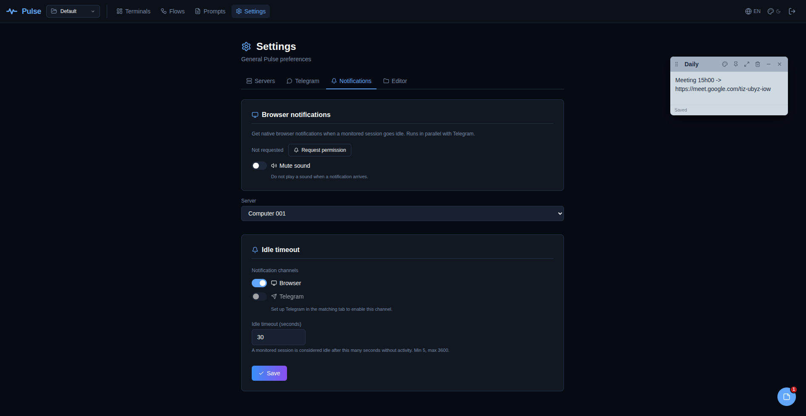
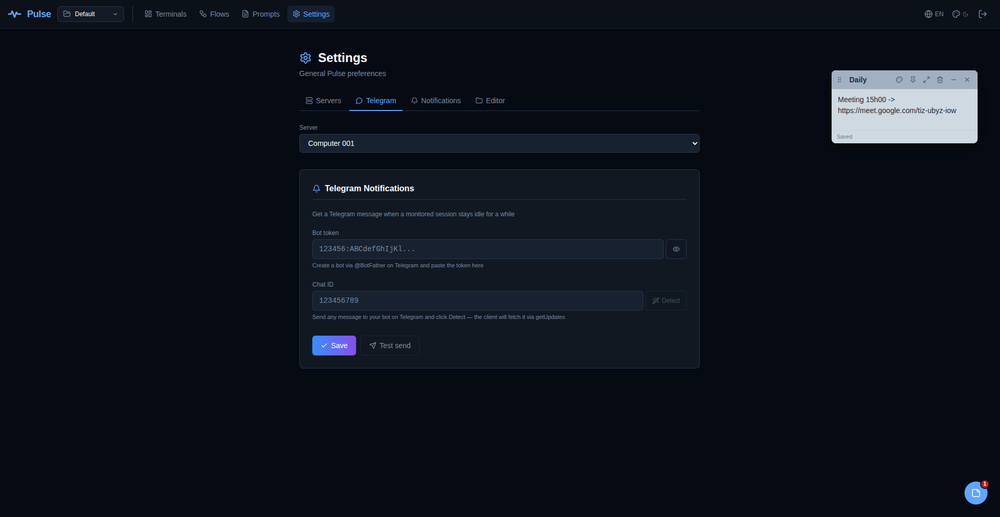
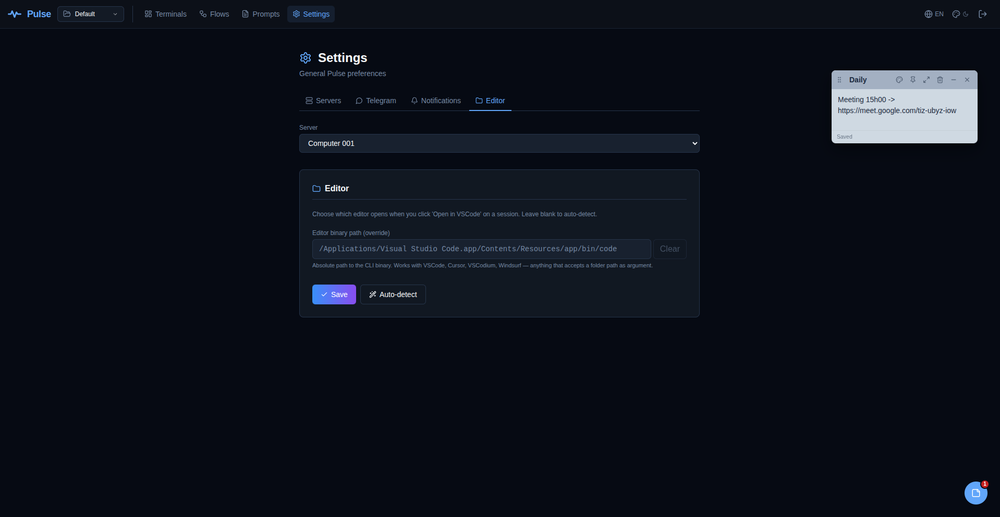

<p align="center">
  
</p>

<h1 align="center">Pulse</h1>

<p align="center">
  <strong>Your AI coding cockpit.</strong><br/>
  Notifications, mobile control, and a shared workspace for every Claude Code / Cursor / Codex / Gemini session you run.
</p>

<p align="center">
  <a href="LICENSE"></a>
  <a href="https://github.com/kevinzezel/pulse/releases"></a>
  <a href="https://github.com/kevinzezel/pulse/stargazers"></a>
</p>

<p align="center">
  <sub>Tested with <strong>Claude Code</strong>, <strong>Cursor CLI</strong>, <strong>Codex CLI</strong>, <strong>Gemini CLI</strong> — works with any CLI that runs in a shell.</sub>
</p>

<p align="center">
  
</p>

You kick off Claude Code, wait three minutes, come back — it's been idle for two and a half, waiting on a Yes/No prompt. Leave the desk for a coffee and your phone buzzes: `frontend::refactor is idle — Approve edit to layout.js?`. You tap yes, it keeps going.

Pulse is a web dashboard for your tmux sessions. The AI CLIs keep running on your machine; you stay connected from any device.

## Install

**Linux / macOS:**

```sh
curl -fsSL https://raw.githubusercontent.com/kevinzezel/pulse/main/install/install.sh | sh
```

**Windows** (requires [WSL2](https://learn.microsoft.com/en-us/windows/wsl/install)):

```powershell
irm https://raw.githubusercontent.com/kevinzezel/pulse/main/install/install.ps1 | iex
```

Open `http://localhost:3000` when it finishes. That's it.

<p align="center">
  
</p>

> **Pin a version** — `PULSE_VERSION=v1.3.2 curl -fsSL …/install.sh | sh`
>
> **Client only** (for a remote server) — `PULSE_CLIENT_ONLY=1 curl -fsSL …/install.sh | sh`
>
> **All flags** — see [the installer source](install/install.sh).

## Why Pulse?

- **vs. a local terminal.** Close the lid and the agent freezes waiting for your input. Pulse's tmux sessions outlive laptop sleep; the idle watcher pings your phone the moment the output stops moving.
- **vs. `tmux` + `ttyd`/`gotty`.** You get a terminal in a browser, but no project-scoped groups, no mobile keybar sized for AI approvals, no notifications, no per-pane "open in VSCode".
- **vs. Tabby / iTerm / Warp.** Single device, no remote-by-default, no shared workspace with notes and flow diagrams.

Pulse runs on your machine, speaks to real tmux, doesn't containerize anything, doesn't phone home.

## Features

### Don't miss an approval prompt

Every 5 seconds Pulse MD5s the tmux pane. Thirty seconds of no change after your last Enter = the AI is waiting on you. The threshold is tunable per deployment (5 seconds to 1 hour) and the toggle is per session — a bell in the sidebar flips it on, persisted as a tmux option so it survives restarts.

Notifications land in the **browser** (toast + sound + Web Notification API) while the dashboard is open, and on **Telegram** when it isn't — so the phone in your pocket tells you when the agent stops. The payload carries the last 20 lines of pane output, which is usually enough to decide yes/no without opening the dashboard.

<table>
  <tr>
    <td width="50%" align="center">
      
      <br/><sub>Browser notification when the dashboard is open</sub>
    </td>
    <td width="50%" align="center">
      
      <br/><sub>Telegram alert when it isn't — with the last 20 lines of output</sub>
    </td>
  </tr>
</table>

<table>
  <tr>
    <td width="50%" align="center">
      
      <br/><sub>Browser notifications + per-server idle timeout</sub>
    </td>
    <td width="50%" align="center">
      
      <br/><sub>Telegram bot token + chat ID, tested right from Settings</sub>
    </td>
  </tr>
</table>

### Work from anywhere, from any device

Fully responsive (rebuilt, not "friendly"). On mobile, `TerminalMosaic` switches to a tab-based layout because `react-mosaic` doesn't play well with touch. A keybar pinned to the bottom gives you `Esc · Tab · ← → ↑ ↓ · Enter · Ctrl+C` — the exact keys the major AI CLIs ask for during approvals.

Touch scroll inside the terminal works via synthesized VT200 mouse-wheel escapes, so Claude Code, `less`, and `vim` all scroll as if you had a wheel. The viewport is pinned (`interactiveWidget: resizes-content`) so the virtual keyboard pushes the page up instead of covering the terminal.

<p align="center">
  
</p>

### Multi-project, multi-session organization

Two levels of grouping: **Projects** at the top (switchable from the header) and **Groups** inside each project. Assign any session to a group; open all sessions in a group with a single click; hide groups you don't want to see today. Drag-and-drop reorders both projects and groups.

Mosaic layouts are saved per `project::group` pair — switch project, your split panes come back exactly where you left them. Selected group and selected flow are persisted per-project too, so the entire view (splits + active group + active flow) restores precisely where you left it, even across devices. When you reopen the dashboard, sessions auto-restore and reconnect with backoff.

<p align="center">
  
</p>

<!-- TODO: add assets/screenshots/mosaic-four-ais.png — split mosaic with four panes, each running a different AI CLI. -->

### Jump to code

`POST /api/sessions/{id}/open-editor` launches `code <cwd>` on the machine where the client runs. Pulse resolves the `code` binary across `apt`, `snap`, flatpak, and forces `DISPLAY=:0` so it works when the client runs under systemd without a login session.

For remote clients, the same button opens `vscode://vscode-remote/ssh-remote+<host><cwd>` — your local VSCode handles the URI and drops into the right directory via Remote-SSH. The "open in VSCode" action is available on every sidebar card, on every mosaic pane, and on group chips ("open all").

<p align="center">
  
</p>

### Keep context alive

- **Sticky notes** — draggable, resizable, color-themed, pinned and minimizable. Stored per project. Auto-saved.
- **Saved prompts** — a searchable library of reusable prompts. One click copies to clipboard or sends straight to the active terminal, with or without Enter. Scope them globally or per project.
- **Flows** — Excalidraw embedded as a page. Multiple diagrams per project, auto-saved, themed alongside the rest of the dashboard.

<table>
  <tr>
    <td width="50%" align="center">
      
      <sub>Saved prompts — one click copies or sends straight to the active pane</sub>
    </td>
    <td width="50%" align="center">
      
      <sub>Flows — architecture diagrams alongside the terminals they describe</sub>
    </td>
  </tr>
</table>

<!-- TODO: add assets/screenshots/sticky-notes.png — dashboard with three floating sticky notes over a mosaic of terminals. -->

### Paste images into AI CLIs

Paste a screenshot straight into the dashboard. Pulse drops the file on the host and types the path as `@/tmp/…` into the active pane — the Claude Code way to attach an image.

### Run Pulse anywhere you SSH

One dashboard, any number of clients. Each remote has its own color, health check, and API key. Session IDs are prefixed `srv-xxx::term-N` so you never lose track of which box a terminal lives on.

<p align="center">
  
</p>

### Share your workspace between machines (optional cloud storage)

Point Pulse at a remote storage driver and all your `projects`, `flows`, `notes`, `prompts`, `servers`, `groups`, `layouts`, `view-state`, `sessions` and `compose-drafts` stop living in local JSON files and live in the cloud instead. Install Pulse on your desktop, laptop, and a VPS, point each one at the same remote, and the same data appears on all three — rename a project on your laptop, hit the tab on your desktop, refetch on focus, it's there. Without a remote configured, Pulse works exactly as before (local files, no dependency on anything external).

Three drivers are built in:

| Driver | Use when | Config |
|---|---|---|
| **Local files** | Default. Single install, no sharing. | (nothing — the absence of cloud config) |
| **MongoDB** | You have a Mongo instance or want Atlas free tier. | `mongodb://` or `mongodb+srv://` URI, optional database name. |
| **S3 / S3-compatible** | You already use AWS, or want zero-ops on Cloudflare R2, or run MinIO on-prem. | Endpoint (optional — blank for AWS), bucket, region, Access Key ID, Secret Access Key, optional prefix. |

The **S3 driver** works with **AWS S3**, **Cloudflare R2** (zero egress), **Google Cloud Storage** (via S3 interoperability), **MinIO** (self-hosted — tick "path-style addressing"), **Backblaze B2**, **DigitalOcean Spaces**, and any other S3-compatible target. Concurrency safety uses the native ETag + `If-Match` — no custom fields added to your objects.

Configure in **Settings → Storage**: three horizontal tabs (Local / MongoDB / S3), each with its own form. Paste the URI or fill the S3 fields, click **Validate & Activate** — the dashboard pings the remote, saves the config, and **swaps the storage backend live**, no restart. The next API call reads from the new driver. Two destructive sync buttons let you migrate in either direction — push local files to the cloud when hooking up a new machine, or pull the cloud back to local files before deactivating. Writes across multiple dashboards are serialized per-document by an optimistic lock with automatic retry, so concurrent edits from two machines never silently drop. If the remote becomes unreachable at runtime, the dashboard fails loudly (503 on every API call) rather than pretending nothing happened.

Secrets in the UI are always masked; every secret field has a **Copy** button that writes the full plaintext to your clipboard — no toggle exposes them on screen.

<!-- TODO: add assets/screenshots/storage-settings.png — Settings → Storage tab with the three-driver tab strip and S3 form visible. -->

### Look the way you want

16 themes: Dracula, Nord, Tokyo Night, Catppuccin (Latte / Frappé / Macchiato / Mocha), Gruvbox (light + dark), Solarized (light + dark), One Dark, Monokai, GitHub Dark Dimmed, plus the default dark and light. 3 UI languages: English, Português (Brasil), Español — 518 keys each.

## How it works

```
┌──────────────┐           ┌─────────────────┐          ┌─────────────────────────┐
│  Browser     │◄─────────►│  Pulse          │◄────────►│  Pulse Client           │
│  (you)       │   HTTPS   │  Dashboard      │   WS +   │  (FastAPI)              │
│              │           │  (Next.js)      │   REST   │                         │
└──────────────┘           └─────────────────┘          │   ▼                     │
                                                        │   tmux                  │
                                                        │   ▼                     │
                                                        │   bash/zsh              │
                                                        │   + Claude Code /       │
                                                        │     Cursor CLI /        │
                                                        │     Codex / Gemini /    │
                                                        │     anything else       │
                                                        └─────────────────────────┘
                                                          host machine
```

- The **dashboard** (Next.js) is stateless — it talks to one or more **clients** (FastAPI + tmux).
- Each **client** runs on the machine whose terminals you want to manage. Sessions live in tmux; the client is a thin bridge between the browser WebSocket and the tmux pty.
- A **background watcher** in the client MD5s every session flagged for idle detection on a 5-second tick and pushes events through the same WebSocket the browser uses.
- Restart the client? Sessions rebuild from `tmux list-sessions`. Nothing to lose.

## Self-hosting

After install, a few commands you'll want. Run `pulse help` for the full list.

```sh
pulse status                    # service health (client + dashboard)
pulse logs client -f            # follow client logs
pulse open                      # launch browser at the dashboard
pulse upgrade                   # fetch latest release and reinstall
pulse uninstall                 # remove everything

pulse keys show                 # print the client's API_KEY
pulse keys regen                # rotate it (updates servers.json too)

pulse config password           # change the dashboard password
pulse config ports              # show current ports
pulse config ports --client 8000 --dashboard 4000   # change them (auto-restarts)
pulse config host               # show current bind hosts
pulse config host --dashboard 0.0.0.0               # expose on the LAN
pulse config secure on          # AUTH_COOKIE_SECURE=true (behind HTTPS)
pulse config rotate-jwt         # regenerate AUTH_JWT_SECRET (kicks every login)
pulse config paths              # print install / config / logs paths
pulse config open config        # open ~/.config/pulse in your file manager
pulse config edit client        # open client.env in $EDITOR
```

Config files (all in `~/.config/pulse/`):

| File              | Required keys |
|-------------------|---|
| `client.env`      | `API_HOST`, `API_PORT`, `API_KEY` |
| `frontend.env`    | `WEB_HOST`, `WEB_PORT`, `AUTH_PASSWORD`, `AUTH_JWT_SECRET`, `AUTH_COOKIE_SECURE` |
| `../local/share/pulse/frontend/data/servers.json` | list of Pulse clients the dashboard connects to |
| `../local/share/pulse/frontend/data/storage-config.json` *(optional)* | when present, the dashboard reads/writes through the configured remote driver (MongoDB or S3) instead of local JSON files |

Prefer `pulse config password` / `pulse config ports` over editing the env files by hand — they keep `servers.json` in sync and restart the right services for you.

### Storage — local files, MongoDB, or S3

The dashboard persists ten JSON files under `frontend/data/` by default: `projects`, `flows`, `groups`, `notes`, `prompts`, `servers`, `layouts`, `view-state`, `sessions`, `compose-drafts`. For a single-install setup that's all you need.

When you want the same workspace on a second machine (desktop + laptop, or desktop + VPS), configure a remote storage driver through **Settings → Storage**. Three drivers available:

**MongoDB** — if you already run Mongo or want Atlas free tier:

1. In the MongoDB tab, paste a `mongodb://…` URI and optionally a database name (defaults to `pulse`).
2. Save. The dashboard runs `ping` + `listCollections` with a 3s timeout, writes `data/storage-config.json`, and hot-swaps the backend — from the next API call on, every read/write goes to MongoDB. **No restart required.**
3. Click **Sync local → cloud** once to seed MongoDB from the current local files (destructive on the Mongo side — requires typing `sync` to confirm).

**S3 / S3-compatible** — AWS S3, Cloudflare R2, Google Cloud Storage, MinIO, Backblaze B2, DO Spaces:

1. In the S3 tab, fill: **endpoint** (leave empty for AWS, or full URL for R2/GCS/MinIO — e.g. `https://<account>.r2.cloudflarestorage.com`), **bucket**, **region** (`us-east-1` default, `auto` for R2), **Access Key ID**, **Secret Access Key**, optional **prefix** (useful to share a bucket with other apps), and **path-style addressing** checkbox (required for MinIO).
2. Save. The dashboard runs `HeadBucket` with a 3s timeout to confirm the credentials can reach the bucket, writes `data/storage-config.json`, and hot-swaps.
3. Click **Sync local → cloud** to seed objects into the bucket.

To go back to local files from either driver: **Settings → Storage → Sync cloud → local** (optional, if you want the current cloud state preserved locally), then **Deactivate remote storage** — the frontend switches back to local files instantly. The local files that were there before activation are untouched and become active again as-is.

Behavior notes:
- **Driver tabs in the UI** — Local / MongoDB / S3 as three horizontal tabs. The active driver is marked with `*`. Switching tabs lets you preview / edit another driver's config without activating it.
- **Secrets are masked but copyable** — URI, Access Key, Secret Key are always rendered as `••••••`. Click the Copy button next to any secret to copy the full plaintext value to your clipboard.
- **Hot-reload, no restart** — saving, changing, or deactivating a remote swaps the backend live. In-flight requests finish on the old backend; the old client is drained for 10s in the background, then closed.
- **Fail-fast on outage** — if the remote becomes unreachable at runtime (network loss, credential rotation, server down), every API call returns `503 errors.storage.unavailable` until it comes back. If the frontend boots with a dead remote, same story — open Settings → Storage and deactivate or fix.
- **Concurrent writes** from multiple dashboards against the same remote are serialized per-object via optimistic locks with auto-retry. Mongo uses a `_version` integer field; S3 uses the native ETag + `If-Match` header. No silent write losses; last-writer-wins only on the rare case of two people editing the exact same field simultaneously.
- **Refetch on tab focus** — when a browser tab regains focus, providers silently refetch so changes made on another machine show up without a manual reload.
- **Requirements**: MongoDB 4.2+ (driver `mongodb@7.x`) or any S3-compatible API. The `data/storage-config.json` file always stays local — it's the config to reach the remote, can't live inside the remote itself.
- **Legacy**: if upgrading from v1.5.x, the existing `data/mongo-config.json` is auto-migrated on first boot to the new unified `data/storage-config.json` and the legacy file is removed. Zero user action needed.

### Behind a reverse proxy

If you put Pulse behind NGINX / Caddy / Cloudflare with TLS:

1. Set `AUTH_COOKIE_SECURE=true` in `frontend.env`.
2. Proxy WebSocket traffic (`/ws/*` on the client, the full dashboard URL on the frontend).
3. Strip the `x-middleware-subrequest` header at the proxy (defense against future CVE-2025-29927 variants).

### Networking defaults

Pulse binds the client and the dashboard to the safest address the platform allows:

| Environment              | Default `API_HOST` / `WEB_HOST` | Why |
|--------------------------|---------------------------------|-----|
| Linux (native) / macOS   | `127.0.0.1`                     | Loopback only — other machines on your LAN can't reach it. |
| Windows (WSL2)           | `0.0.0.0`                       | Services run inside the WSL2 VM, which has its own network namespace. The Windows browser reaches them through WSL2's *localhost forwarding*, and **that feature only reflects `0.0.0.0` bindings** — `127.0.0.1` inside WSL is invisible to Windows. |

Under WSL2, `0.0.0.0` does **not** automatically publish the service on your LAN — by default Hyper-V's NAT keeps traffic inside the WSL VM, and only the Windows host reaches it via `localhost`. The API key on the client and the password + JWT on the dashboard still gate access.

**To open access for other devices on your LAN** (phone, another laptop), flip both binds to `0.0.0.0` explicitly:

```sh
pulse config host --client 0.0.0.0 --dashboard 0.0.0.0
```

This works on every platform: on Linux/Mac it starts exposing the ports on the LAN; on WSL2 it keeps exposure as is (already `0.0.0.0`) but makes the intent explicit. `pulse config host` auto-restarts the affected services and warns if you're exposing over plain HTTP — consider putting it behind a reverse proxy with TLS (see above) if the LAN isn't trusted.

To revert to loopback-only:

```sh
pulse config host --client 127.0.0.1 --dashboard 127.0.0.1   # Linux/Mac only
```

On WSL2, reverting the client to `127.0.0.1` will make the Windows browser fail to reach it — keep it on `0.0.0.0`.

### Multiple servers — dashboard + remote clients

Pulse is split by design into two pieces: the **dashboard** (the web UI you open in the browser) and the **client** (the agent that runs tmux sessions on a host). One dashboard can manage clients running on many machines — your local workstation, a VPS, a LAN box, a Docker host — each appearing as a separate entry in the sidebar, selectable with one click.

#### Install only the client on a remote server

On the remote machine:

```sh
PULSE_CLIENT_ONLY=1 curl -fsSL https://raw.githubusercontent.com/kevinzezel/pulse/main/install/install.sh | sh
pulse keys show    # copy the API_KEY printed
```

`PULSE_CLIENT_ONLY=1` skips the dashboard install and its Node.js dep — the box only needs `tmux`, `python3 ≥ 3.10`, and `uv` (auto-installed by the script). The client runs under a systemd user unit (Linux) or a launchd agent (macOS) and auto-restarts on failure.

If the remote is behind NAT and you want to reach it from a dashboard running elsewhere:

1. Open port `8000` (or whatever you passed as `PULSE_CLIENT_PORT`) on the server's firewall / cloud provider security group.
2. `pulse config host --client 0.0.0.0` on the remote — makes the client listen on all interfaces instead of loopback only.
3. If the link isn't trusted (public internet), put NGINX / Caddy / Cloudflare + TLS in front — see **Behind a reverse proxy** above. The API key is the primary gate, but HTTPS is still worth adding.

#### Install only the dashboard

Flip the flag:

```sh
PULSE_DASHBOARD_ONLY=1 curl -fsSL https://raw.githubusercontent.com/kevinzezel/pulse/main/install/install.sh | sh
```

Useful when you want the dashboard on your laptop but every client on remote machines. `servers.json` is seeded empty; you add hosts via the UI.

#### Register a client in the dashboard

In the dashboard: **Settings → Servers → Add**. Fill in:

| Field      | Value |
|------------|-------|
| Name       | Anything (e.g. `vps-prod`, `macbook`, `home-lab`). |
| Protocol   | `http` for plain, `https` if fronted by TLS. |
| Host       | IP or hostname **as the browser sees it**. If both dashboard and client live on the same box: `127.0.0.1`. For a remote: the public IP or DNS name. |
| Port       | Matches `API_PORT` on the remote client. |
| API Key    | From `pulse keys show` on the remote. |

Save. The dashboard probes the new client and it appears in the sidebar. Repeat for every machine. Click between entries to switch which host you're driving — each shows its own tmux sessions independently.

From the same dashboard you can also:
- **Edit** a server (rename, change port, rotate its API key).
- **Delete** a server.
- **Reorder** by drag. The order persists in `servers.json` on the dashboard machine.

#### Arquitetura típica

```
[ laptop / PC — browser ]
          │
          ▼
[ dashboard (Next.js)  ]  ──►  [ client #1 ] localhost:8000 (same box)
                           ──►  [ client #2 ] 10.0.0.50:8000 (LAN VPS)
                           ──►  [ client #3 ] api.example.com (public, HTTPS)
```

Dashboard holds `servers.json` (its own config — not shared). Each client is independent, has its own `tmux` sessions, its own API key, and survives dashboard restarts.

## Development

Prerequisites: `tmux`, `python3 ≥ 3.10`, `node ≥ 18.18`. On Debian/Ubuntu or macOS, the start script installs them for you on first run.

```sh
git clone https://github.com/kevinzezel/pulse.git
cd pulse
./start.sh
```

See [CONTRIBUTING.md](CONTRIBUTING.md) for the full dev setup, project layout, and conventions.

## Changelog

See [CHANGELOG.md](CHANGELOG.md) for release notes.

## Acknowledgments

Pulse is built on top of a lot of great open-source work. A non-exhaustive list of the projects it leans on most:

- [tmux](https://github.com/tmux/tmux) (ISC) — the terminal multiplexer that makes sessions persistent.
- [xterm.js](https://github.com/xtermjs/xterm.js) (MIT) — the browser-side terminal emulator.
- [Excalidraw](https://github.com/excalidraw/excalidraw) (MIT) — the whiteboard that powers Flows.
- [react-mosaic](https://github.com/nomcopter/react-mosaic) (MIT) — the tiling window manager for the desktop layout.
- [react-rnd](https://github.com/bokuweb/react-rnd) (MIT) — draggable and resizable sticky notes.
- [FastAPI](https://github.com/tiangolo/fastapi) (MIT) — the HTTP + WebSocket server on the client side.
- [Next.js](https://github.com/vercel/next.js) (MIT) — the dashboard framework.
- [lucide-react](https://github.com/lucide-icons/lucide) (ISC) — icons.

Licenses for each dependency ship with it via `npm` / `pip` and travel with every install. Pulse does not redistribute these projects' source.

## License

[MIT](LICENSE) © 2026 Kevin Zezel Gomes.

Pulse embeds [Excalidraw](https://github.com/excalidraw/excalidraw/blob/master/LICENSE), [xterm.js](https://github.com/xtermjs/xterm.js/blob/master/LICENSE), [react-mosaic](https://github.com/nomcopter/react-mosaic/blob/master/LICENSE), and other components — all MIT or MIT-compatible. See [Acknowledgments](#acknowledgments).

## Contributing

PRs welcome. Read [CONTRIBUTING.md](CONTRIBUTING.md) first. For vulnerabilities, see [SECURITY.md](SECURITY.md).
